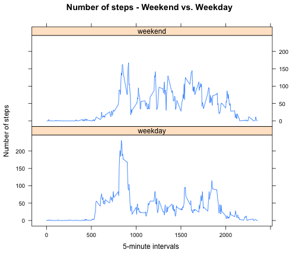

-----------------------------------------------------------------------------
title: "PA1_template"
-----------------------------------------------------------------------------

# Loading and preprocessing the data


```r
if(!file.exists("Activity.zip")){
  
  fileUrl <-"https://d396qusza40orc.cloudfront.net/repdata%2Fdata%2Factivity.zip"
  download.file(fileUrl,destfile="Activity.zip",method="curl")
}
unzip("Activity.zip")
```

Set Activity data to local data.frame

```r
Activity_data <- read.csv("activity.csv")
```

Remove all NA values from Activity database

```r
Activity_data2 <- na.omit(Activity_data)
```

Load dplyr library

```r
library(dplyr)
```

Create a data frame tbl from local data.frame

```r
acttbl <- tbl_df(Activity_data2)
```

Select steps, and date from data frame tbl, group by date, 
and summarize steps data by date and save to activity_output

```r
 activity_output <-
   acttbl %>%
   select(steps, date) %>%
   group_by(date) %>%
   summarize(sum(steps)) 
```

Rename activity_output sum(steps) column to steps

```r
  colnames(activity_output)[2] <- "steps"
```

# What is mean total number of steps taken per day?

Create histogram graph with he total number of steps taken each day

```r
 hist(activity_output$steps, xlab = "steps", main = " No. of steps - each day")
```

 

Calculate the mean total number of steps taken per day

```r
 mean(activity_output$steps, na.rm = TRUE)
```

```
## [1] 10766.19
```

Calculate the median total number of steps taken per day

```r
 median(activity_output$steps, na.rm = TRUE)
```

```
## [1] 10765
```

# What is the average daily activity pattern?

Select steps, and interval from data frame tbl, group by interval, 
and summarize steps data by interval and save to activity1_output
for daily activity pattern time series plot

```r
activity1_output <-
  acttbl %>%
  select(steps, interval) %>%
  group_by(interval) %>%
  summarize(round(mean(steps),0))
```

Rename activity_output sum(steps) column to steps

```r
colnames(activity1_output)[2] <- "steps"
```

Make a time series plot of the 5-minute intervals

```r
plot(activity1_output$interval,activity1_output$steps, type = "l",
     xlab ="interval", ylab = "steps")
```

 

The 5-minute interval with the maximum number of steps

```r
activity1_output[activity1_output$steps == max(activity1_output$steps),]
```

```
## Source: local data frame [1 x 2]
## 
##   interval steps
## 1      835   206
```

# Imputing missing values

Report the total number of NA values in the database

```r
sum(!complete.cases(Activity_data))
```

```
## [1] 2304
```

Devise a strategy to fill in the NA values.  
Add the mean for that 5-minute interval to new database

```r
total <- merge(Activity_data,activity1_output,by=c("interval"))
total <- total[order(total$date, total$interval),]
steps <- ifelse(is.na(total$steps.x),total$steps.y, total$steps.x )
total <- cbind(total, steps)
total <- subset(total, date != "NA", select = c(interval, date, steps))
```

Set data table for 5-minute interval with filled in NA values. 
data table will be used to create the histogram.

```r
tottbl <- tbl_df(total)

total_output <-
  tottbl %>%
  select(steps, date) %>%
  group_by(date) %>%
  summarize(sum(steps)) 

colnames(total_output)[2] <- "steps"
```

Histogram of the total number of steps taken each day

```r
hist(total_output$steps, xlab = "steps", main = "No. of steps - each day")
```

 

Mean for total number of steps taken per day

```r
mean(total_output$steps, na.rm = TRUE)
```

```
## [1] 10765.64
```

Median for total number of steps taken per day

```r
median(total_output$steps, na.rm = TRUE)
```

```
## [1] 10762
```

Values slightly differ from the estimates from the first part of the assignment.

Imputing missing data on the estimates of the total daily number of steps 
do not impact results.

# Are there differences in activity patterns between weekdays and weekends?


Create a new factor variable in the dataset 
with two levels – “weekday” and “weekend”.

```r
tottbl$date <- as.Date(tottbl$date)
days <- weekdays(tottbl$date)
dayswe <- ifelse(days %in% c("Sunday","Saturday"), "weekend", "weekday")
newtotal <- cbind(tottbl, dayswe)
```

Create data table for 5-minute interval
Weekend vs. Weekday

```r
newtottbl <- tbl_df(newtotal)

newtotal_output <-
    newtottbl %>%
    select(interval, dayswe, round(steps)) %>%
    group_by(interval, dayswe) %>%
    summarize(round(mean(steps),0)) 

colnames(newtotal_output)[3] <- "steps"
```

Panel plot containing a time series plot of the 5-minute interval 
and the average number of steps taken.

```r
library(lattice)
xyplot(steps~interval|dayswe, data = newtotal_output, type = "l",
       main="Number of steps - Weekend vs. Weekday",
       xlab="5-minute intervals ", ylab="Number of steps",
       layout=c(1,2))
```

 
